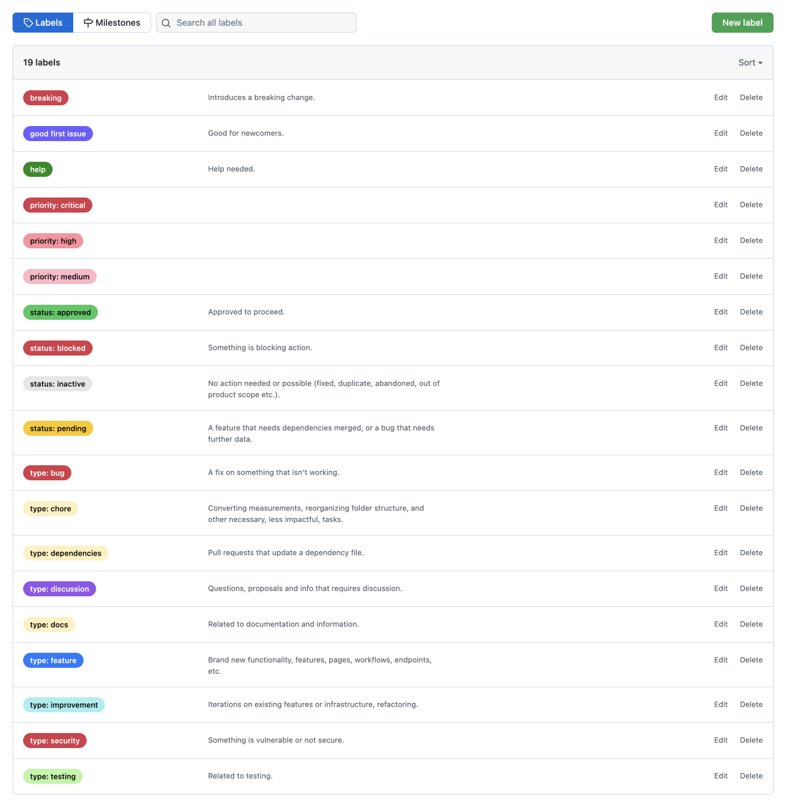

# Github Labels Sync

Synchronize the github labels of a repo.

Labels default config inspired by:

- https://github.com/abdonrd/github-labels
- https://seantrane.com/posts/logical-colorful-github-labels-18230/
- https://medium.com/@dave_lunny/sane-github-labels-c5d2e6004b63

Using [github-label-sync](https://github.com/Financial-Times/github-label-sync).

## How to run

First, fill the environment variables in the `.env` file. Then, run the command:

`npm start`: run the plugin

`npm run dry`: dry run the plugin

---

